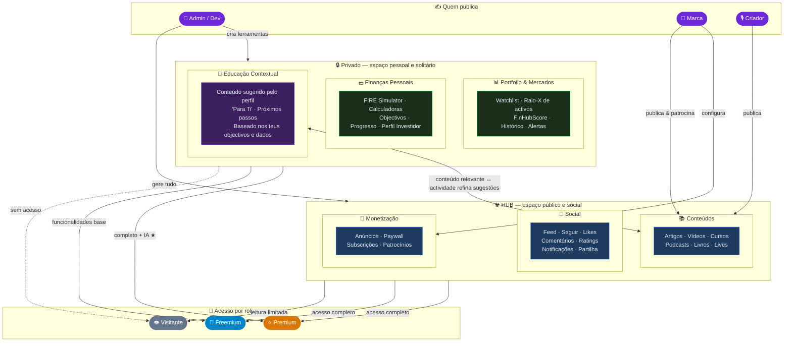
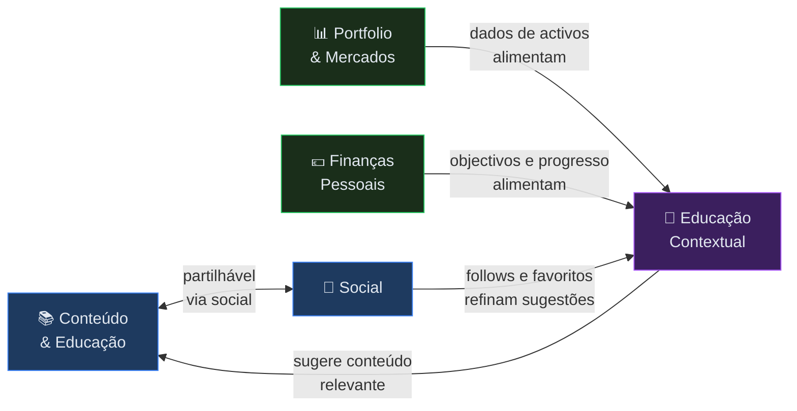

# FinHub — Arquitectura de Produto

> **Data:** 2026-03-22
> **Propósito:** documento de referência para decisões de layout, navegação e produto.
> Qualquer alteração estrutural à plataforma deve partir daqui.

---

## 1. Modelo Mental da Plataforma

A FinHub organiza-se em **duas zonas distintas**:

```
┌─────────────────────────────────────────────────────────┐
│  🌐  HUB  —  espaço público, social e de descoberta     │
│  Conteúdo · Social · Criadores · Notícias · Ads         │
└────────────────────┬────────────────────────────────────┘
                     │
              ponte de educação
              (conteúdo contextual)
                     │
┌────────────────────▼────────────────────────────────────┐
│  🔒  PRIVADO  —  espaço pessoal e solitário             │
│  Portfolio · Finanças Pessoais · Ferramentas · /conta   │
└─────────────────────────────────────────────────────────┘
```

### HUB — espaço público e social
O utilizador vem aqui para **descobrir, aprender, interagir e partilhar**.
É o lado visível da plataforma. Criadores e marcas publicam aqui.
O conteúdo é partilhável, comentável, avaliável.

### PRIVADO — espaço pessoal e solitário
O utilizador vem aqui para **trabalhar nas suas próprias finanças**.
É o lado privado. Só o próprio utilizador vê os seus dados.
Ferramentas, simuladores, portfolio, objectivos de vida.

### A Ponte — Educação Contextual
O espaço privado **puxa conteúdo do HUB de forma contextual**.
Quando o utilizador está no FIRE Simulator a 40% do objectivo,
a plataforma sugere artigos relevantes do HUB — sem o utilizador
ter de os ir procurar. O conteúdo vai ter com ele.

---

## 2. Diagrama de Arquitetura

### 2a. Visão Geral (HUB vs Privado)



### 2b. Sinergias entre módulos



---

## 3. Matriz de Roles e Acesso

| Zona | Módulo | Visitante | Freemium | Premium | Criador | Admin |
|------|--------|:---------:|:--------:|:-------:|:-------:|:-----:|
| **HUB** | Conteúdo | Lê (limitado) | ✅ | ✅ ★ | ✅ | ✅ |
| **HUB** | Social | Vê apenas | ✅ | ✅ | ✅ | ✅ |
| **HUB** | Ads | Vê | Vê | Vê (menos) | Vê | Configura |
| **PRIVADO** | Portfolio & Mercados | ❌ | Base | ✅ ★ | ❌ ¹ | ✅ |
| **PRIVADO** | Finanças Pessoais | ❌ | Base | ✅ ★ | ❌ ¹ | ✅ |
| **PRIVADO** | Educação Contextual | ❌ | Base | ✅ ★ | ❌ ¹ | ✅ |
| **CRIAÇÃO** | Publicar conteúdo | ❌ | ❌ | ❌ | ✅ | ✅ |
| **CRIAÇÃO** | Gerir plataforma | ❌ | ❌ | ❌ | ❌ | ✅ |

> ¹ Criadores têm o seu próprio dashboard com analytics — não usam as ferramentas de utilizador.
> ★ Premium tem acesso avançado: histórico, IA, dados detalhados.

---

## 4. Estado Actual da Navegação vs Desejado

### Problema actual
A navegação principal (`MAIN_NAV_LINKS` em `shellConfig.tsx`) mistura zonas:

```
Home | Educadores | Conteúdos | Notícias | Mercados | Ferramentas
 HUB      HUB          HUB        HUB      PRIVADO     PRIVADO
```

**Mercados** e **Ferramentas** são zonas privadas — só fazem sentido para utilizadores autenticados com dados próprios. Aparecer no nav público confunde o visitante e dilui a proposta de valor.

O **Social** (Feed, Favoritos, Seguindo, Notificações) está enterrado no dropdown do avatar — invisível como pilar do HUB.

### Navegação desejada

#### Nav principal — HUB (visível para todos)
```
Home | Educadores | Conteúdos | Notícias | [Social ↓]
```
- `Social ↓` poderia ser um dropdown ou link directo para o Feed quando autenticado

#### User menu / área privada (só para autenticados)
```
Avatar ↓
├── 🏠 A minha conta       → /conta
├── 📊 Portfolio & Mercados → /mercados
├── 🛠️ Ferramentas         → /ferramentas
├── 🔔 Notificações        → /notificacoes
└── [Creator Dashboard / Admin / Logout]
```

#### Lógica de separação visual
- **HUB** = barra de navegação superior (pública, sempre visível)
- **PRIVADO** = menu do avatar + `/conta` sidebar (privado, só autenticados)
- Criadores e Admins têm os seus próprios shells separados

---

## 5. Regras de Produto

### Conteúdo
- Todo o conteúdo do HUB **deve ser partilhável** (link directo, opcionalmente embed)
- Conteúdo premium deve ter preview (teaser) para não-subscritos
- Criadores publicam no HUB; os seus analytics são privados (Creator Dashboard)

### Social
- Feed, Seguir, Favoritos, Comentários são **features do HUB** — não são features privadas
- Notificações são HUB (eventos sociais) + Privado (alertas de portfolio)

### Ferramentas
- As ferramentas de portfolio e finanças pessoais são **exclusivamente privadas**
- Criadores **não usam** as ferramentas de utilizador (têm o seu próprio dashboard)
- Visitantes vêem uma página de teaser das ferramentas mas não acedem aos dados

### Educação Contextual (a ponte)
- No espaço privado, o sistema **sugere conteúdo do HUB** com base em:
  1. Interesses declarados no onboarding
  2. Objectivos definidos no FIRE/finanças pessoais
  3. Activos na watchlist (ex: tem Tesla → sugere análise de Tesla)
  4. Histórico de consumo no HUB (follows, favoritos)
- Esta ponte é **bidirecional**: o HUB também pode contextualizar conteúdo com dados do perfil privado do utilizador (ex: badge "✓ tens este ETF no portfolio")

### Premium vs Freemium
- A diferença não é **o que vêem** mas **o quão fundo vão**
- Freemium tem acesso a tudo mas com limites (menos histórico, menos detalhe)
- Premium desbloqueia: histórico completo, IA, dados avançados, menos ads

---

## 6. Próximas Tasks de Layout

> Estas tasks derivam deste documento e estão pendentes de prompts Codex.

| # | Task | Zona afectada | Prioridade |
|---|------|---------------|------------|
| L1 | Mover Mercados e Ferramentas para fora do `MAIN_NAV_LINKS` público; colocar no user menu para autenticados | `shellConfig.tsx` | 🔴 Alta |
| L2 | Adicionar Social (Feed) ao HUB nav (visível para autenticados no main nav) | `shellConfig.tsx` | 🟡 Média |
| L3 | Visual diferenciador HUB vs Privado (ex: cor de fundo, label "HUB" / "O meu espaço") | Layout shells | 🟡 Média |
| L4 | Página de teaser de Ferramentas para visitantes (CTA de registo) | `/ferramentas` | 🟡 Média |
| L5 | Educação Contextual no `/conta` — bloco "Para Ti" baseado em dados privados | `UserAccountShell` | 🟢 Pós-v1.0 |
| L6 | Badge "✓ tens este activo" em cards de conteúdo do HUB | Cards de conteúdo | 🟢 Pós-v1.0 |

---

## 7. Ficheiros Chave

```
FinHub-Vite/src/shared/layouts/shellConfig.tsx         ← nav config (MAIN_NAV + user menu)
FinHub-Vite/src/shared/layouts/PublicShell.tsx         ← shell HUB público
FinHub-Vite/src/shared/layouts/UnifiedTopShell.tsx     ← shell para autenticados no HUB
FinHub-Vite/src/shared/layouts/UserAccountShell.tsx    ← shell privado (P9.4 — a criar)
FinHub-Vite/src/shared/layouts/CreatorDashboardShell.tsx ← shell criadores
FinHub-Vite/src/shared/layouts/AdminShell.tsx          ← shell admin
FinHub-Vite/src/pages/+Page.tsx                        ← homepage (HUB)
FinHub-Vite/src/pages/conta/+Page.tsx                  ← entrada do espaço privado (P9.4)
```

---

## 8. Índice de Sistemas — Documentação Técnica

> Referência rápida para agentes e developers. Cada sistema tem o seu próprio documento de especificação.

| Sistema | Doc | Estado | Descrição |
|---------|-----|--------|-----------|
| **Arquitectura de Produto** | `ARCHITECTURE.md` ← este ficheiro | ✅ | HUB vs PRIVADO, roles, navegação, layout tasks |
| **Motor de Recomendação** | `RECO_ENGINE.md` | ✅ | "Para Ti" feed, taxonomia de tags, sinais, afinidades, R1–R5 |
| **SEO** | `SEO.md` | ✅ | react-helmet, sitemap, JSON-LD, indexabilidade, SEO-1 a SEO-8 |
| **Analytics** | `ANALYTICS.md` | ✅ | PostHog, Sentry, GA4/GTM, 4 audiências, funil, AN-1 a AN-13 |
| **Tasks e Prompts** | `TASKS.md` + `PROMPTS_EXECUCAO.md` | ✅ | Release map, estado de fases, prompts Codex |
| **Auditoria de Ficheiros** | `AUDIT_FICHEIROS.md` | ✅ | Ficheiros a apagar, arquivar, dívida técnica |
| **Autenticação** | `AUTH.md` (a criar) | ❌ | JWT, roles, OAuth, guards |
| **Notificações** | `NOTIFICATIONS.md` (a criar) | ❌ | Sistema de notificações em tempo real |
| **Pagamentos** | `PAYMENTS.md` (a criar) | ❌ | Subscriptions, Stripe, planos |

### Como usar este índice

Quando um agente começa a trabalhar numa área:
1. Lê `ARCHITECTURE.md` para entender o modelo mental da plataforma
2. Lê o doc específico do sistema em que vai trabalhar
3. Consulta `TASKS.md` para o estado actual e próximas tasks
4. Consulta `PROMPTS_EXECUCAO.md` para o prompt a executar no Codex

**Nunca implementar sem ler primeiro a documentação — evita duplicações e contradições.**
